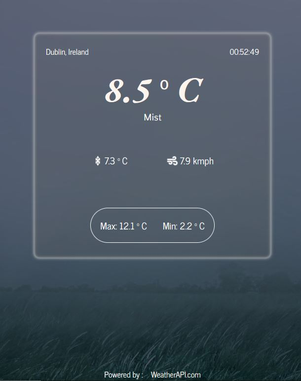

# Weather App
[View the App here](https://farrukh-ahm.github.io/weatherapp/)

The Weather App is created using [The Weather API](https://www.weatherapi.com/). The dispalys the current weather informations like the temperature, feels-like, wind speed, etc. The background image changes according to the current weather condition of the area.

## Future Plans:
- Planing to add the search feature so tha a user can search the weather of any city in the world.
- Currently, the Api provides the forecast for only next two days on free plan, hence that feature hasn't been implemented here.

