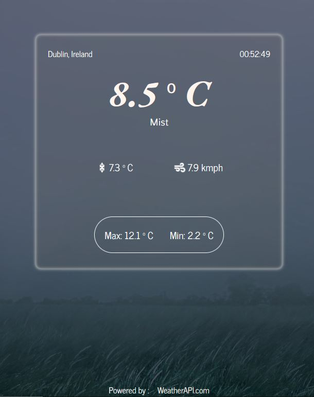

# Weather App
[View the App here](https://farrukh-ahm.github.io/weatherapp/)

The Weather App is created using [The Weather API](https://www.weatherapi.com/). The dispalys the current weather informations like the temperature, feels-like, wind speed, etc. The background image changes according to the current weather condition of the area.

### Recent Update:
- Added search feature to find the weather of different locations around the world.

